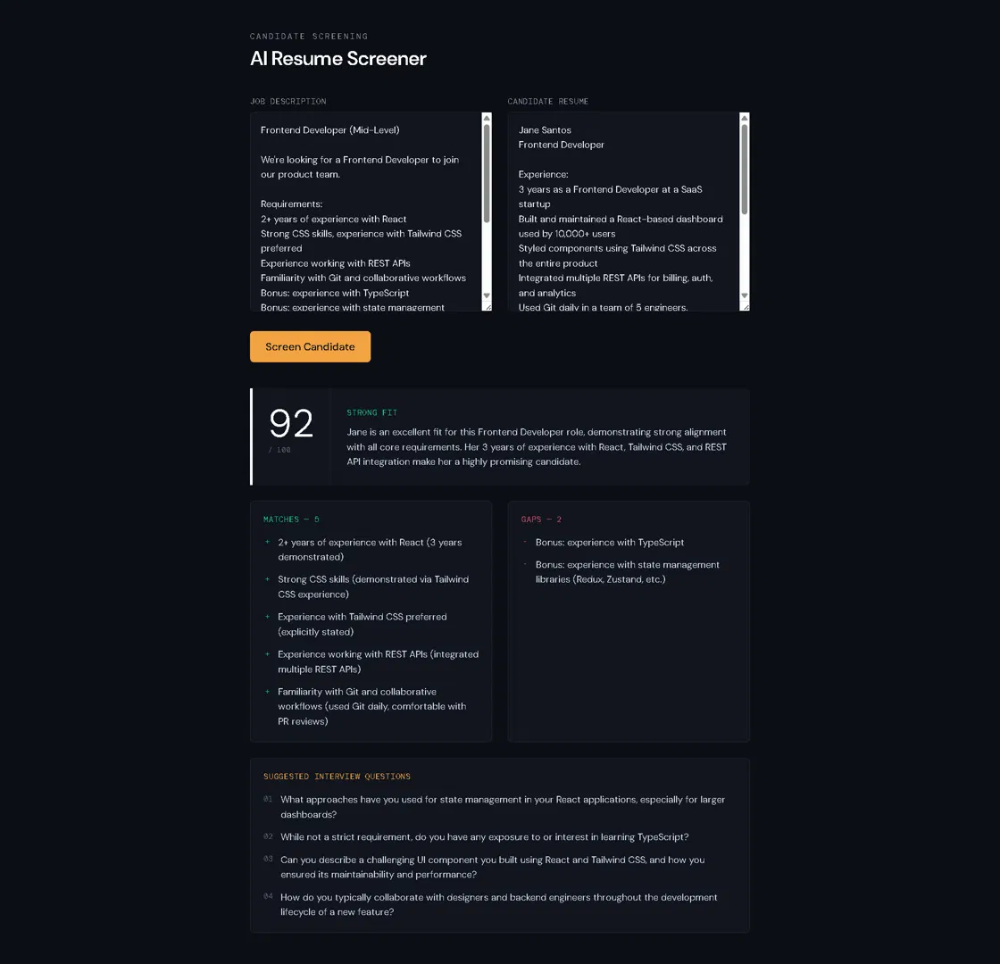

# AI Resume Screener

A recruiter-facing tool that screens a candidate's resume against a job description using AI, returning a structured fit assessment: a 0–100 score, a recommendation (strong / maybe / weak), a summary, matched requirements, gaps, and suggested interview questions.



## Stack

- **Frontend:** React + Vite + Tailwind CSS
- **Backend:** Node + Express (proxies the AI call so the API key stays server-side)
- **AI:** Google Gemini API (`gemini-2.5-flash`), prompted for structured JSON output with defensive parsing and a repair-retry on malformed responses

## How it works

1. Paste a job description and a candidate's resume into the two text areas.
2. Click **Screen Candidate**.
3. The frontend sends both texts to the Express backend.
4. The backend prompts Gemini to return a strict JSON object matching a fixed schema, strips any markdown code fences Gemini might add, and validates that all required fields are present — retrying once if parsing fails.
5. The frontend renders the result: a verdict strip (score + recommendation), matched requirements, gaps, and interview questions.

## Running locally

You'll need two terminals running at once — one for the frontend, one for the backend.

### 1. Clone and install

```bash
git clone https://github.com/mors-codes/ai-resume-screener.git
cd ai-resume-screener
npm install
cd server
npm install
cd ..
```

### 2. Add your Gemini API key

Get a free API key from [Google AI Studio](https://aistudio.google.com), then create `server/.env`:
GEMINI_API_KEY=your-key-here

### 3. Run both servers

**Terminal 1 — backend:**
```bash
cd server
node index.js
```

**Terminal 2 — frontend:**
```bash
npm run dev
```

Open the URL Vite prints (usually `http://localhost:5173`).

## Notes

- This is a portfolio/demo project: single-user, no auth, no persisted candidate data.
- The Gemini API free tier is used throughout — no paid API costs to run this yourself.